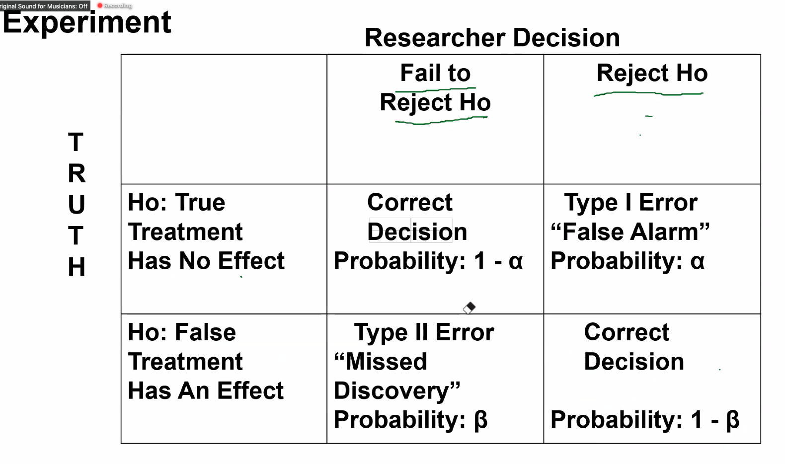
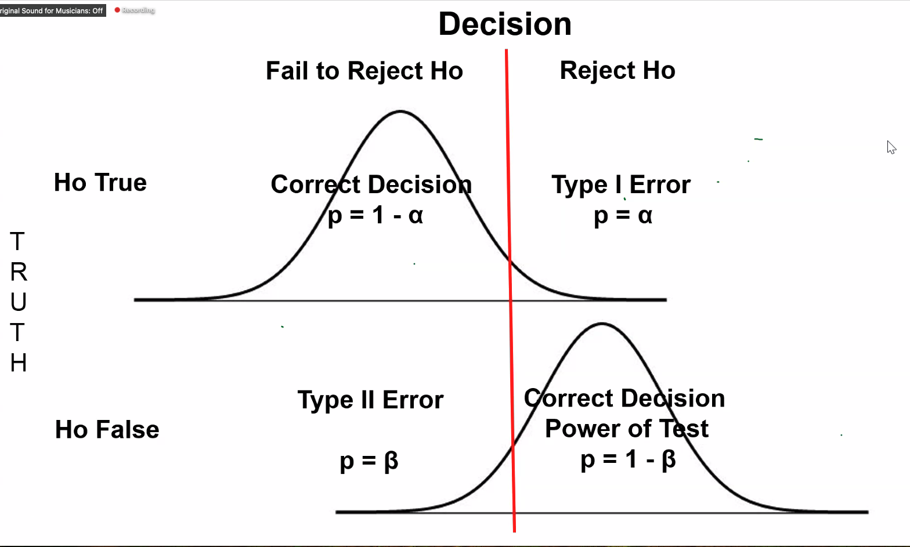
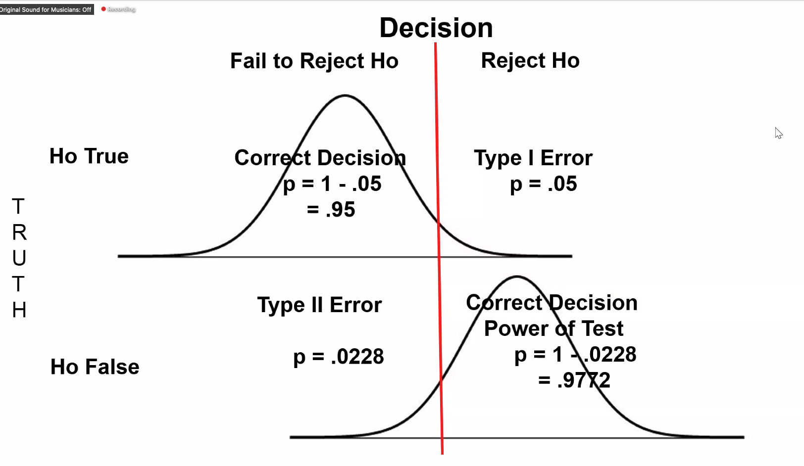
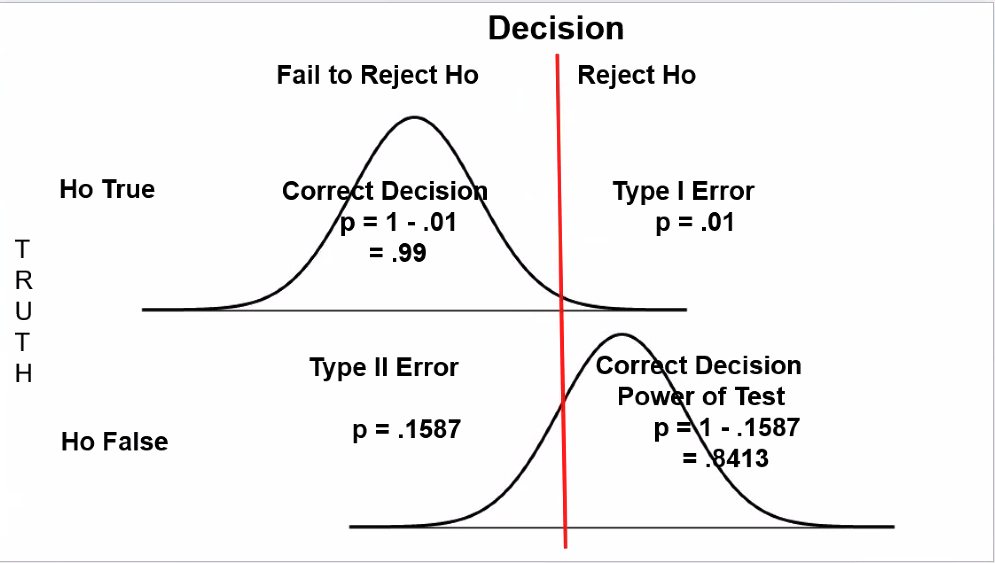
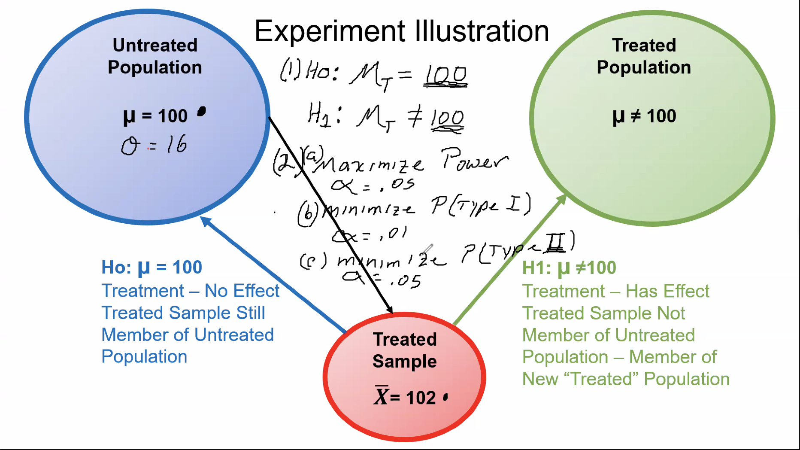

from random import sample

# Lecture Notes

## Representativeness
- Most important factor of a sample from a population is its representativeness
- Populations have parameters, samples have statistics

## Sampling
- process of selecting a sample from a much larger population
- Different types of sampling methods
  - Random sample (this is basically impossible)
    - Sample in which each member has an equal chance of being chosen
    - Issues
      - Often not possible to identify every member of the population
      - Usually cannot have access to every member of the population
      - Individuals selected for inclusion need to be put back into the population for possible reselection
      - Individuals can refuse to participate and once people refuse, you no longer have a "random" sample
      - "volunteer bias" people who agree to participate in studies often differ in important ways from people who do not participate
  - Systematic sample
    - For example, selecting every 10th name on your list
  - Convenience sample
    - People who are convenient to us
    - Research are typically done on convenience samples
- Stratified sample
  - Any sample can be stratified, means the proportion of individuals with certain characteristics in the sample matches the proportion of people in the population
  - Stratification is typically only done on one or two characteristics
  - Adding more stratification makes it more and more difficult to create stratified samples
- Random Sampling Process
  - Process in which every participant selected for inclusion in the study has an equal probability of being selected
  - Note that this is different from a "random sample", as people have a right to refuse
  - Random sampling process require being able to identify all members of a population

## Probability
- Involves knowing everything about the population and estimating what the sample will look like
  - For example, you know what the cards in a deck are

## Inferential statistics
- Involves knowing everything about the sample and making estimates about what the population looks like
- Opposite of probability

## Variable
- Variables have to be able to "vary", cannot be "constant" values
- Has to vary in the context in which you are talking about, not in general
  - For example, if a class is entirely women, then gender would not be a variable for that class
- Independent variable
  - Variable with a cause outside the scope of the study
  - Researchers determine what the levels are for the study, but study does not tell us anything about the cause
- Dependent variable
  - Values depend upon the independent variable 
  - Has to be numerically measured
  - If there is no independent variable, there cannot be a dependent variable
- In order to run a study, you must have at least one independent variable and one dependent variable

## Discrete vs Continuous Variables
- Continuous variable can take on any value within a certain range
  - For example, GPA is continuous between 0.0 and 4.0
  - Age is another example of a continuous variable
- Discrete value has places where it does and does not exist
  - For example, with letter grades, you have A B C D F, without continuous things in between
- Continuous variables can be made into discrete variables, but the other way is not possible
  - You can reduce the precision of a continuous 

## Quantitative vs Qualitative variables
- Quantitative variables are variables that take on an amount
  - These variables can be either discrete or continuous
- Qualitative variables differ in kind
  - These variables are always discrete
  - Ex: types of therapy, behavior therapy, CBT, DBT, etc.

## Research Variables
- Important variable types are independent and dependent variables
- Studies involve systematically varying one or more variables in order to measure the effects of this variation on one or more other variables
- Variables that are systematically varied are called independent variables
  - These independent variables must be made categorical, cannot be continuous
- Variables that are measured are called dependent variables
- Independent and Dependent variables are operationally defined
  - Number of levels and specific levels to include
  - Three main components of putting participants in levels of the independent variable
    - Will different participants be in each different level or will the same people be in each different level

## Between Subjects IV vs Within Subjects IV
- Between subjects: completed unrelated people in different levels
  - If 20 people, 10 randomly assigned to one, 10 randomly assigned to the other
- Within subjects: same people or a relationship between people in other levels
  - If 10 people, all assigned to both levels
  - If 10 pairs of siblings, and one sibling in each level
  - If 20 people given IQ test, created 10 matched pair, then put one from each pair in each level
  - Must have a 1:1 relationship between subjects to have this within subjects relationship

## Dependent Variables
- Must be numerically measured in order to determine the effect of varying the independent variable
- Dependent variable must be measured in exactly the same way for each level of the independent variable

## Explained vs Unexplained Variation
- Explained
  - Difference between the means of the different groups
- Unexplained
  - How much people in each group differ from one another
- All test statistics are a ratio of the explained to unexplained variation
- Explained variation has to be larger than the unexplained variation

## Extraneous and Confounding Variables
- Extraneous variable is anything that varies besides the independent variable (IV) and dependent variable (DV)
  - Most extraneous variables don't matter
  - For example, if studying aggression in children playing video games, height or weight are probably extraneous variables
- Confounding variable is an extraneous variable that is confounded with a level of the IV (independent variable)
  - For example, if all boys were in one group and all girls were in another group
  - Some confounding variables we worry about, others we don't
- Confounding variable is by definition an extraneous variable, while an extraneous variable may or may not be confounding
- Can only talk about causation if randomly assigning people to different groups

## Predictor and Criterion Variables
- Predictor variable does the predicting
- Criterion variable gets predicted
- For example, if looking at number of miles commuted and student's GPA
  - Number of miles commuted is the predictor variable
  - GPA is the criterion variable

## Scales of Measurement
- Four scales of measurement
  - Numbers don't always mean the same thing, depends on the scale of measurement
  - *When getting into statistics, everything we do depends on the scales of measurement and being able to determine which is which*
- **Nominal**
  - Unordered categories
  - Lowest scale of measurement
  - Ex: gender, Male - 1, Female - 2, Transgender - 3
    - Ethnicity, gender, types of TV shows, brands of cars, different video games
    - Does not have an "objective order"
  - Only mathematical operation we can do with nominal scales of measurement is equivalence
  - Measure of central tendency: Mode
    - "average" with nominal data really means the mode
  - This is a qualitative scale
    - Categories are discrete
- **Ordinal**
  - Ordered categories (with an objective ordering)
  - One level is higher than another
  - Ex grades: A is higher than B, B is higher than C, etc.
  - Mathematical operations can be equivalence as well as greater than or less than
  - Measure(s) of central tendency: Mode, Median
  - This is a qualitative scale
    - Categories are discrete
- **Interval**
  - Ordered categories
  - Equal size intervals
  - 0 is not the absence of the characteristic; "arbitrary zero point"
    - Ex, 0 temperature does not mean "no temperature"
  - Mathematical operations
    - equal, greater than, less than, add/subtract, mean
    - Cannot multiply/divide
  - Measure(s) of central tendency: Mode, Median, Mean
  - This is a quantitative scale
    - Can be discrete or continuous
- **Ratio**
  - Ordered categories
  - Equal size intervals
  - 0 means the absence of that characteristic; "true zero point"
    - Ex, 0 inches in length or 0 inches in height
  - Mathematical operations
  - equal, greater than, less than, add/subtract, mean, multiply/divide
  - Measure(s) of central tendency: Mode, Median, Mean
  - This is a quantitative scale
    - Can be discrete or continuous
- In terms of statistics, interval & ratio are the same scale
  - Nominal, ordinal, and interval/ratio
- Three questions to determine scale
  - Are the categories ordered?
    - If no, you know it is nominal data
    - If yes, continue
  - Are the intervals equal sized?
    - If no, you know it is ordinal
    - If yes, continue
  - Is there a true zero?
    - If no, it is interval
    - If yes, it is ratio

## Basic Mathematical Operations
### Order of operations
- Parentheses
- Exponents
- Multiplication & Division
- Addition & Subtraction
- *Always work from left to right for operations in the same level*
- Parentheses can be used to change the "natural order" of the order of operations
- Goal is to simplify everything to addition/subtraction
### Commutative Properties
- Commutative Property of Multiplication
  - When an operation is all multiplication, order does not matter
    - `2 * 3 * 4 == 4 * 3 * 2`
- Commutative Property of Addition
  - When an operation is all addition, order does not matter
    - `2 + 3 + 4 == 4 + 3 + 2`
- There are no commutative properties for division or subtraction
### Exponents
- Exponent indicates repeated multiplication
- Pick up on slide 21

## Probability and Hypothesis Testing
### Area Under the Normal Curve
- Area between points under the curve corresponds to the proportion of people that fall between those points
  - This is also the Probability of Randomly Selecting a person between the points on the curve
- When doing hypothesis testing, you can divide outcomes by "Common Outcomes" and "Rare Outcomes"
  - The dividing line is approximately +/- 2 standard deviations, with above 2 being "Rare"
  - A "rare outcome" for someone with an IQ would be above 132 or below 68
  - If you get a rare outcome, you may want to investigate "what is going on"
- Research is never done on individuals, it is always done on groups
  - Rule of thumb is that you need at least 20 individuals per level of the independent variable
- A "Rare Outcome" is defined as an outcome that has either
  - Less than or equal to a 5% probability of occurring by chance (α/"alpha" = 0.05)
    - Remember that 2.5% of this is on the upper end of the distribution, 2.5% of this is on the lower end
    - α/2 = 0.025
  - Less than or equal to a 1% probability of occurring by chance (α/"alpha" = 0.01)
    - Remember that 0.5% of this is on the upper end of the distribution, 0.5% of this is on the lower end
    - α/2 = 0.005
- Between the rare outcomes is `1 - α`, if α = 0.05, then `1 - α = 0.95`
### Distribution of Raw Scores
- So far, all distributions have been distributions of Individual Raw Scores
### Distributions of Sample means
- Every score in the distribution is a mean for a sample of N individuals
- N is the constant number of individuals in each sample
- Population of a distribution of sample means has
  - Population mean
  - Population standard deviation
- The bigger the samples get, the standard deviations get smaller
  - The standard deviation from the individuals (for IQ, 16) is divided by the square root of the sample mean size (N)
  - If the N of sample means is 4, new standard deviation is 16/2 = 8
  - If the N of sample means is 16, new standard deviation is 16/4 = 4
  - If the N of sample means is 25, new standard deviation is 16/5 = 3.2
  - If the N of sample means is 100, new standard deviation is 16/10 = 1.6
  - If the N of sample means is 10,000, new standard deviation is 16/100 = 0.16
### Probabilities and Z-Scores
- As the Z-scores get bigger (or the absolute value of negative Z-scores gets larger), the probabilities get smaller
### Cut Off Values
- Z = 1.96 cuts off the upper 2.5% (0.025)
- Z = -1.96 cuts off the lower 2.5% (0.025)
- Z = 2.576 cuts off the upper 0.5% (0.005)
- Z = -2.576 cuts off the lower 0.05% (0.005)

### Hypothesis Testing
- Steps of a Hypothesis test
  1. Write hypothesis
  2. Set alpha level
  3. Collect data, calculate test statistic
  4. Make decision
     - If |test statistic value| >= |Critical test statistic value|, then we say the treatment had an effect or "reject the null hypothesis"
       - 'p <= alpha'
     - If |test statistic value| < |Critical test statistic value|, then we say the treatment had no effect
       - 'p > alpha'
- $H_o$: treatment had no effect
  - Null hypothesis
  - The null hypothesis says that there is no treatment effect, so the population mean ("mu"/$\mu$) is still 100
- $H_1$: treatment had an effect
  - Alternative hypothesis
  - If the treatment did have an effect, we know that the population mean ("mu"/$\mu$) is not equal to 100
#### Experiment
- Type I error
  - If treatment has no effect, but researcher concludes the treatment has an effect
- Type II error
  - If treatment has an effect, but researcher concludes the treatment has no effect
- Power
  - The treatment has an effect, and the researcher concludes it does

|                                      | Fail to reject $H_o$             | Reject $H_o$               |
|--------------------------------------|----------------------------------|----------------------------|
| $H_o$: true/treatment has no effect  | correct decision                 | Type I error "False alarm" | 
| $H_o$: false/treatment has an effect | Type II error "Missed discovery" | Correct decision / "Power" |

- We say that we "failed to reject Ho/the null hypothesis"
- 
- **Fail to reject $H_o$ (Do NOT reject $H_o$)**
  - Find no evidence to support conclusion that $H_o$ is False
  - This DOES NOT MEAN $H_o$ is True
- 
- Probability of making a type I error is the area above alpha
- Probability of making a type II error is the area below alpha
- Using $\alpha = 0.05$
  - Increases probability of making Type I error
  - Decreases probability of making Type II error
  - Power increases
- Using $\alpha = 0.01$
  - Decreases probability of making Type I error
  - Increases probability of making Type II error
  - Decreases power
- "Researcher wants to minimize the probability of making a Type I error..."
  - Use $\alpha = 0.01$
- "Researcher wants to minimize the probability of making a Type II error..."
  - Use $\alpha = 0.05$
- "Researcher wants to maximize Power..."
  - Use $\alpha = 0.05$
- 
- 
- 
### Z-Test
- $Z = \frac{\bar{X} - \mu}{\sigma_{\bar{x}}}$
  - $\bar{x}$ = sample mean
  - $\mu$ = population mean
  - $\sigma_{\bar{x}}$ = population standard deviation
- If obtained value is positive, you use the positive $Z_{crit}$ value
- If obtained value is negative, you use the negative $Z_{crit}$ value
- If you use 0.05, the $Z_{crit}$ value is $\pm1.96$
- If you use 0.01, the $Z_{crit}$ value is $\pm2.576$
- If $Z_{obt}$ is less than or equal to $Z_{crit}$ then you fail to reject $H_o$
- If $Z_{obt}$ is greater than $Z_{crit}$, then you reject $H_o$
- First steps to solving problems
  - Pick out each item
    - $\mu_u$ = untreated population mean
    - $\sigma$ = population standard deviation
    - $N$ = number of participants in the study
- Once we know that the treatment has an effect
  - Estimating treatment effect
    - "Cohen's D" = absolute value of x-bar minus mu over sigma x
    - $d = \frac{\left|\bar{x} - \mu\right|}{\sigma_x}$
#### Python Functions
```python
import numpy as np
from scipy.stats import norm

def one_sample_z_test(
        population_mean,
        population_sd,
        sample_number,
        sample_mean,
        alpha
    ):
    sample_sigma = population_sd / np.sqrt(sample_number)
    z_statistic = (sample_mean - population_mean) / sample_sigma
    reject = False
    z_critical = np.round(norm.ppf(1 - alpha / 2), 3)
    if np.abs(z_statistic) >= z_critical:
        reject = True
    d = (sample_mean - population_mean) / population_sd
    ninety_five_ci_lower = sample_mean - (sample_sigma * 1.96)
    ninety_five_ci_upper = sample_mean + (sample_sigma * 1.96)
    ninety_nine_ci_lower = sample_mean - (sample_sigma * 2.576)
    ninety_nine_ci_upper = sample_mean + (sample_sigma * 2.576)
    results = {
        "sample sigma": sample_sigma,
        "z-statistic": z_statistic,
        "reject Ho": reject,
        "d" : d,
        "95% CI": [ninety_five_ci_lower, ninety_five_ci_upper],
        "99% CI": [ninety_nine_ci_lower, ninety_nine_ci_upper]
    }
    return results

one_sample_z_test(
    population_mean=80,
    population_sd=5,
    sample_number=7,
    sample_mean=88,
    alpha=0.05
)
```


### T-Test
- If a problem says the "population standard deviation is unknown"
- When we reject $H_o$, the best single point estimate for the treated population mean is the sample mean
  - We aren't super sure of this, so we use a confidence interval
- When we don't know the population standard deviation, we need to calculate the sample standard deviation
  - This sample standard deviation is a "descriptive" statistic of our particular sample
  - This becomes our best estimate of the population standard deviation
  - This is considered a "biased" estimate
    - It describes our data correctly, but it is "biased" in the context of the larger population
  - This is not a good estimate for the entire population, because it underestimates the population values
- We want to be able to apply a correction that corrects small samples more than it does big samples
  - Sample SD is more biased when you have a smaller sample
  - The correction is to divide by N - 1 instead of N
  - $\hat{s}^2 = \frac{1}{n-1} \sum_{i=1}^{n} (x_i - \bar{x})^2$
  - $\hat{s} = \sqrt{\hat{s}^2}$
- For midterm two, we will only be using unbiased estimates
- When we have a data set, it is assumed that the mean of the data set was determined before we collected the data
- "Degrees of freedom" = $df$
- The t distribution is an approximation of the normal curve
  - The greater the degrees of freedom, your critical values match those from the z-test
#### Python code
```python
import numpy as np
from scipy import stats

def one_sample_t_test(
        population_mean,
        sample_number,
        sample_mean,
        sample_data,
        alpha
    ):
    degrees_of_freedom = sample_number - 1
    t_critical = stats.t.ppf(1 - alpha / 2, sample_number - 1)
    sum_squares = np.sum((sample_data - sample_mean)**2)
    s_hat_x = np.sqrt(sum_squares / degrees_of_freedom)
    s_hat_x_bar = s_hat_x / np.sqrt(sample_number)
    t_statistic = (sample_mean - population_mean) / s_hat_x_bar
    reject = False
    if np.abs(t_statistic) >= t_critical:
        reject = True
    d_hat = np.abs(sample_mean - population_mean) / s_hat_x
    r_squared = t_statistic**2 / (t_statistic**2 + degrees_of_freedom)
    ninety_five_ci_lower = sample_mean - s_hat_x_bar * stats.t.ppf(1 - (0.05 / 2), degrees_of_freedom)
    ninety_five_ci_upper = sample_mean + s_hat_x_bar * stats.t.ppf(1 - (0.05 / 2), degrees_of_freedom)
    ninety_nine_ci_lower = sample_mean - s_hat_x_bar * stats.t.ppf(1 - (0.01 / 2), degrees_of_freedom)
    ninety_nine_ci_upper = sample_mean + s_hat_x_bar * stats.t.ppf(1 - (0.01 / 2), degrees_of_freedom)
    results = {
        "s_hat_x": np.round(s_hat_x, 4),
        "s_hat_x_bar": np.round(s_hat_x_bar, 4),
        "degrees of freedom": degrees_of_freedom,
        "t-statistic": np.round(t_statistic, 4),
        "t-critical": t_critical,
        "reject Ho": reject,
        "effect size (d_hat)": np.round(d_hat, 4),
        "coefficient of determination (r**2)": r_squared,
        "coefficient of non-determination (1 - r**2)": 1 - r_squared,
        "95% CI": [ninety_five_ci_lower, ninety_five_ci_upper],
        "99% CI": [ninety_nine_ci_lower, ninety_nine_ci_upper]
    }
    return results

array_one = np.array([60, 62, 58, 64, 56, 66, 54, 68, 52])
one_sample_t_test(
    population_mean=70,
    sample_number=9,
    sample_mean=60,
    sample_data=array_one,
    alpha=0.01
)
array_two = np.array([70, 72, 68, 73, 67, 74, 66, 71, 69, 72, 68])
one_sample_t_test(
    population_mean=65,
    sample_number=11,
    sample_mean=70,
    sample_data=array_two,
    alpha=0.05
)
```

### Analysis of Variance - ANOVA
- If group sizes are not the same, the only change is that we need to calculate the harmonic mean
  - $n_h = \frac{K}{\frac{1}{n_1} + \frac{1}{n_2}}$
- "Between subjects" = "independent samples"
  - Meaning there is no 1:1 relationship between people in one level and people in another level
  - If you see "N people were randomly assigned to each group", then it is between subjects
- "Within subjects" = "dependent samples"
  - There is a 1:1 relationship between each person in one level and a person in another level
    - One way is that each person is in each condition
    - People in groups could also be related genetically (MZ twins / DZ twins / siblings / parent & offspring)
    - Does not matter the degree of genetic relationship across studies, but needs to be the same within a study
  - You will typically be able to determine which type of analysis based on the scenario
    - For example "all participants learned one set of material one way and then all participants learned another way"
    - "pair of twins were randomly assigned such that..."
  - Because each person is related, we can calculate a mean for each person
- For a within subjects ANOVA, the degrees of freedom you will use for looking up f-values are between group and between people
- ANOVA is also sometimes referred to as an "f test"

| Source | Sum of Squares (SS) | 
#### Python
```python
import numpy as np
from scipy import stats

def harmonic_mean(a, b):
    return 2 / ((1/a) + (1/b))

def two_sample_between_subjects_anova(
        treated_sample,
        untreated_sample,
        alpha
):
    treated_sample_mean = np.mean(treated_sample)
    sum_squares_treated_sample = np.sum((treated_sample - treated_sample_mean)**2)
    untreated_sample_mean = np.mean(untreated_sample)
    sum_squares_untreated_sample = np.sum((untreated_sample - untreated_sample_mean)**2)
    grand_mean = np.mean(np.concatenate((treated_sample, untreated_sample)))
    ss_between_group = (len(treated_sample) * (treated_sample_mean - grand_mean)**2) + (len(untreated_sample) * (untreated_sample_mean - grand_mean)**2)
    ss_within_group = sum_squares_treated_sample + sum_squares_untreated_sample
    df_between_group = 1
    df_within_group = (len(treated_sample) - 1) + (len(untreated_sample) - 1)
    ms_between_group = ss_between_group / df_between_group
    ms_within_group = ss_within_group / df_within_group
    f_statistic = ms_between_group / ms_within_group
    f_critical = stats.f.ppf(q=1-alpha, dfn=df_between_group, dfd=df_within_group)
    reject = False
    if np.abs(f_statistic) >= np.abs(f_critical):
        reject = True
    if len(treated_sample) == len(untreated_sample):
        n = len(treated_sample)
    else:
        n = harmonic_mean(len(treated_sample), len(untreated_sample))
    ninety_five_ci_lower = (treated_sample_mean - untreated_sample_mean) - np.sqrt(ms_within_group/n) * stats.studentized_range.ppf(1-0.05, 2, df_within_group)
    ninety_five_ci_upper = (treated_sample_mean - untreated_sample_mean) + np.sqrt(ms_within_group/n) * stats.studentized_range.ppf(1-0.05, 2, df_within_group)
    ninety_nine_ci_lower = (treated_sample_mean - untreated_sample_mean) - np.sqrt(ms_within_group/n) * stats.studentized_range.ppf(1-0.01, 2, df_within_group)
    ninety_nine_ci_upper = (treated_sample_mean - untreated_sample_mean) + np.sqrt(ms_within_group/n) * stats.studentized_range.ppf(1-0.01, 2, df_within_group)
    eta_squared = ss_between_group / (ss_between_group + ss_within_group)
    omega_squared = (ss_between_group - df_between_group * ms_within_group) / (ss_between_group + ss_within_group + ms_within_group)
    results = {
        "f_statistic": f_statistic,
        "f_critical": f_critical,
        "reject": reject,
        "95% CI": [ninety_five_ci_lower, ninety_five_ci_upper],
        "99% CI": [ninety_nine_ci_lower, ninety_nine_ci_upper],
        "eta squared (biased)": eta_squared,
        "omega squared (unbiased)": omega_squared,
        "grand mean": grand_mean,
        "source table": {
            "between_group": {"ss": ss_between_group, "df": df_between_group, "ms": ms_between_group},
            "within_group": {"ss": ss_within_group, "df": df_within_group, "ms": ms_within_group}
        }
    }
    return results

# Even sample sizes
treated_bt_sample = np.array([65, 64, 63, 62, 60, 60, 58, 57, 56, 55])
untreated_ct_sample = np.array([76, 75, 74, 72, 70, 70, 69, 67, 65, 62])
two_sample_between_subjects_anova(treated_bt_sample, untreated_ct_sample, 0.01)

# Uneven sample sizes
treated_cbt_sample = np.array([87, 84, 82, 81, 79, 77, 76, 73, 70, 71])
untreated_ct_sample = np.array([78, 73, 72, 70, 68, 59])
two_sample_between_subjects_anova(treated_cbt_sample, untreated_ct_sample, 0.05)

def two_sample_within_subjects_anova(
        treated_sample,
        untreated_sample,
        alpha
):
    treated_sample_mean = np.mean(treated_sample)
    sum_squares_treated_sample = np.sum((treated_sample - treated_sample_mean)**2)
    untreated_sample_mean = np.mean(untreated_sample)
    sum_squares_untreated_sample = np.sum((untreated_sample - untreated_sample_mean)**2)
    grand_mean = np.mean(np.concatenate((treated_sample, untreated_sample)))
    person_mean = (treated_sample + untreated_sample) / 2
    ss_between_group = (len(treated_sample) * (treated_sample_mean - grand_mean)**2) + (len(untreated_sample) * (untreated_sample_mean - grand_mean)**2)
    ss_within_group = sum_squares_treated_sample + sum_squares_untreated_sample
    ss_between_people = np.sum(2 * (person_mean - grand_mean)**2)
    ss_true_error = ss_within_group - ss_between_people
    df_between_group = 1
    df_within_group = (len(treated_sample) - 1) + (len(untreated_sample) - 1)
    df_between_people = len(treated_sample) - 1
    df_true_error = df_within_group - df_between_people
    ms_between_group = ss_between_group / df_between_group
    ms_true_error = ss_true_error / df_true_error
    f_statistic = ms_between_group / ms_true_error
    f_critical = stats.f.ppf(q=1-alpha, dfn=df_between_group, dfd=df_true_error)
    reject = False
    if np.abs(f_statistic) >= np.abs(f_critical):
        reject = True
    if len(treated_sample) == len(untreated_sample):
        n = len(treated_sample)
    else:
        n = harmonic_mean(len(treated_sample), len(untreated_sample))
    ninety_five_ci_lower = (treated_sample_mean - untreated_sample_mean) - np.sqrt(ms_true_error/n) * stats.studentized_range.ppf(1-0.05, 2, df_true_error)
    ninety_five_ci_upper = (treated_sample_mean - untreated_sample_mean) + np.sqrt(ms_true_error/n) * stats.studentized_range.ppf(1-0.05, 2, df_true_error)
    ninety_nine_ci_lower = (treated_sample_mean - untreated_sample_mean) - np.sqrt(ms_true_error/n) * stats.studentized_range.ppf(1-0.01, 2, df_true_error)
    ninety_nine_ci_upper = (treated_sample_mean - untreated_sample_mean) + np.sqrt(ms_true_error/n) * stats.studentized_range.ppf(1-0.01, 2, df_true_error)
    eta_squared = ss_between_group / (ss_between_group + ss_true_error)
    omega_squared = (ss_between_group - (df_between_group * ms_true_error)) / (ss_between_group + ss_true_error + ms_true_error)
    results = {
        "f_statistic": f_statistic,
        "f_critical": f_critical,
        "reject": reject,
        "95% CI": [ninety_five_ci_lower, ninety_five_ci_upper],
        "99% CI": [ninety_nine_ci_lower, ninety_nine_ci_upper],
        "eta squared (biased)": eta_squared,
        "omega squared (unbiased)": omega_squared,
        "grand mean": grand_mean,
        "source table": {
            "between_group": {"ss": ss_between_group, "df": df_between_group, "ms": ms_between_group},
            "within_group": {"ss": ss_within_group, "df": df_within_group},
            "between_people": {"ss": ss_between_people, "df": df_between_people},
            "true_error": {"ss": ss_true_error, "df": df_true_error, "ms": ms_true_error}
        }
    }
    return results

array_blue = np.array([65, 66, 64, 68, 62, 70, 60, 72, 58, 67, 63])
array_white = np.array([63, 66, 60, 64, 62, 70, 56, 68, 58, 67, 59])
two_sample_within_subjects_anova(array_blue, array_white, 0.05)
```

|            | z-test | t-test  | ANOVA   |
|------------|--------|---------|---------|
| $\mu_x$    | given  | given   | unknown |
| $\sigma_x$ | given  | unknown | unknown |


### Midterm Review
- Most important thing is to know which type of analysis to do

## One-Way Between Subjects ANOVA
- Null Hypothesis
  - $\mu_{red} = \mu_{green} = \mu_{white}$
  - This is basically the same as our null hypothesis for any other test
- Alternative hypothesis
  - "Not all $\mu$ are equal"
- Setting power is the same as other tests
  - "Max power" = 0.05
  - "Minimize type I" = 0.01
  - "Minimize type II" = 0.05
  - etc.
- Sum of squares (within group)
  - $SS_{wg} = SS_{red} + SS_{green} + SS_{white}$
- Sum of squares (between group)
  - $SS_{bg} = n_1(\bar{x}_1 - \bar{x}_{..})^2 + n_2(\bar{x}_2 - \bar{x}_{..})^2 + n_3(\bar{x}_3 - \bar{x}_{..})^2$
- Degrees of freedom (within group)
  - $df_{wg} = (n - 1) + (n - 1) + (n - 1)$
- Degrees of freedom (between group)
  - $k - 1$
- Proportion of Total variation in the DV
  - 
- Post-hoc analysis
  - Need to compare the means between the different groups
  - It doesn't matter which order we do these in, but we need to compare each group
  - For example, red to green, red to white, and green to white
  - Alpha has to be the same as the ANOVA
  - For each group, we subtract the means and then divide by the standard deviation
    - If the resulting value is greater than your Q critical value, then you reject the null hypothesis
  - $\sqrt{\frac{MS_{wg}}n}$
  - For our q critical value, we want to use $q(k, df_{wg})$
  - If we reject the null hypothesis, then we calculate a confidence interval
  - $\bar{x_1} - \bar{x_2} \pm \sqrt{\frac{MS_{wg}}n}(q(k, df_{wg}))$
## One way within subjects ANOVA
- This is performed in the same way as the two-sample within-subjects ANOVA

## Correlation & Regression
- "A researcher wants to investigate if there is a relationship between..."
- Predictor and Criterion variable
  - Predictor variable is usually called $X$
  - Criterion variable is usually called $y$
- Your predictor variable is the independent variable
- The criterion variable is the predicted output, or dependent variable
- We are looking at the pattern of the results
  - X variable is on the x-axis (horizontal), y variable is on the y-axis (vertical)
- Learning Pearson product moment coefficient, used when for both variables are measured in interval ratio data
- The output, $r$, can be anywhere between -1.0 and 1.0
  - The sign indicates whether it is a positive or negative correlation/relationship
  - 0 represents "no relationship"
  - Whether or not a relationship is positive or negative does not indicate how strong the relationship is, that is measured by the absolute value of the number
- Our initial correlation $r$, only tells us if there is a correlation in the sample
  - We need a hypothesis to test if there is a correlation in the population
  - $H_o: \rho = 0$
  - $H_1: \rho \ne 0$
- For correlation and regression, we use two degrees of freedom, instead of 1
  - For example, if there are nine values in our data set
  - $t(7)_{.05/2} = 2.365$
- If our t-test rejects $H_o$, then we have a correlation within our population
```python
import numpy as np

def correlation(array_one, array_two):
    numerator = np.sum((array_one - np.mean(array_one)) * (array_two - np.mean(array_two)))
    denominator = np.sqrt(np.sum((array_one - np.mean(array_one))**2))

midterm_scores = np.array([70, 72, 68, 74, 66, 76, 64, 78, 62])
final_scores = np.array([60, 63, 57, 63, 57, 64, 56, 65, 55])
```