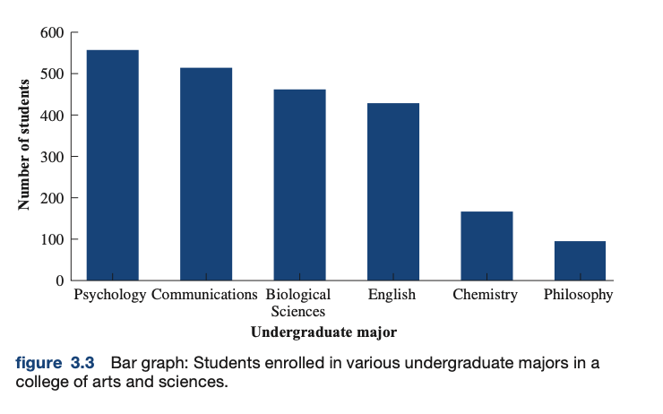
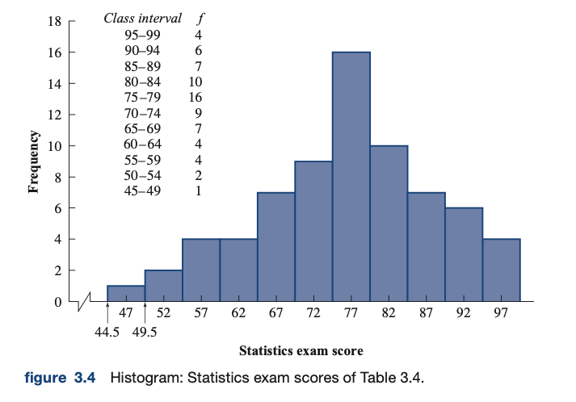
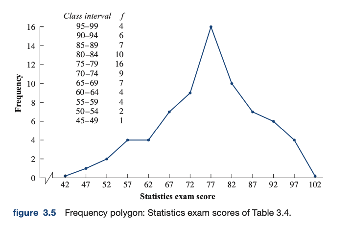
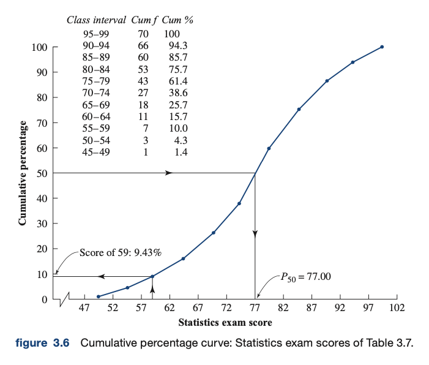
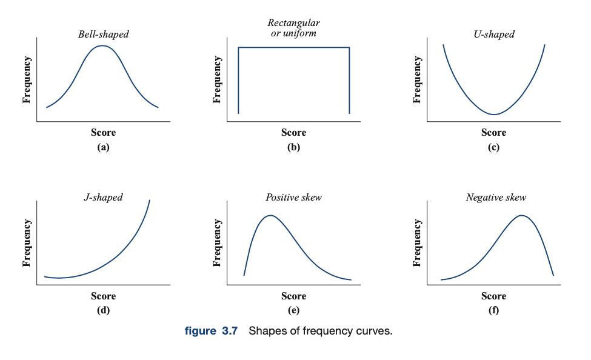

### Chapter 3: Frequency Distributions
#### Introduction: Ungrouped Frequency Distributions
- `frequency distribution`: presents the score values and their frequency of occurrence
  - These values are usually listed in rank order, with the lowest scores at bottom of table
#### Grouping Scores
- When there are many scores and a wide range of scores, listing individual results can make it difficult to understand the shape of the distribution and its central tendency
- In these instances, can group scores into "class intervals" and presented as *frequency distribution of grouped scores*
- When grouping data, need to consider how wide intervals are, as information is lost when you make groups
  - The larger the interval, the greater the ambiguity
  - The more intervals used, the narrower each interval is
  - A tip is to use between 10 and 20 intervals for most distributions
#### Constructing Frequency Distribution of Grouped Scores
- Steps to construct a frequency distribution of grouped scores
  1. Find the range of the scores
  2. Determine the width of each class interval (*i*)
  3. List the limits of each interval, placing the interval containing the lowest score value at the bottom
  4. Tally the raw scores into the appropriate class intervals
  5. Add the tallies for each interval to obtain the interval frequency
#### Relative Frequency, Cumulative Frequency, and Cumulative Percentage Distributions
- `relative frequency distribution`: indicates the proportion of the total number of scores that occurs in each interval
- `cumulative frequency distribution`: indicates the number of scores that fall below the upper real limit of each interval
- `cumulative percentage distribution`: indicates the percentage of scores that fall below the upper real limit of each interval
- To convert a frequency distribution into a relative frequency distribution, frequency for each interval is divided by the total number of scores
  - Therefore, `Relative f = f/N`
  - Relative frequency tells you the proportion of scores contained in the interval
- Cumulative frequency for each interval is found by adding the frequency of the interval to the frequencies of all class intervals below it
- Cumulative percentage for each interval is found by converting cumulative frequencies to cumulative percentages
  - `cumulative % = (cum f)/N * 100`
#### Percentiles
- Percentiles are measures of relative standing and are used extensively in education to compare performance of an individual to that of a reference group
  - For example, the 60th percentile is the value on the measurement scale below which 60% of the scores in the distribution will fall
- `percentile/percentile point`: value on the measurement scale below which a specified percentage of the scores in the distribution fall
#### Computation of Percentile Points
- Can use symbol like P50 to refer to the 50th percentile point
- To find any percentile point
  1. Determine the frequency of scores below the percentile point
  2. Determine the lower real limit of the interval containing the percentile point
  3. Determine the number of additional scores we must acquire in the interval to reach the percentile point
  4. Determine the number of additional units into the interval we must go to acquire the additional number of scores
  5. Determine the percentile point
- Equation form
  - Percentile point = XL + (*i/fi*)(cum *fP* - cum *fL*)
  - Where
    - XL: value of the lower real limit of the interval containing the percentile point
    - cum *fP*: frequency of scores below the percentile point
    - cum *fL*: frequency of scores below the lower real limit of the interval containing the percentile point
    - *fi*: frequency of the interval containing the percentile point
    - *i*: width of the interval
#### Percentile Rank
- `percentile rank`: the percentage of scores with values lower than the score in question
#### Computation of Percentile Rank
- This is the reverse of calculating a percentile point
- Assumes the scores within any interval are evenly distributed
- Equation form
  - Percentile rank = ((cum *fL* + (*fi/i*)(*X - XL)*) / *N*) * 100
  - Where
    - cum *fL*: frequency of scores below the lower real limit of the interval containing the score *X*
    - *X*: score whose percentile rank is being determined
    - *XL*: scale value of the lower real limit of the interval containing the score *X*
    - *i*: interval width
    - *fi*: frequency of the interval containing the score *X*
    - *N*: total number of raw scores
#### Graphing Frequency Distributions
- Graphs can help make it easier to see important features of data
- Graphs have two axes: vertical and horizontal
  - Vertical axis is called the *ordinate* or *Y* axis
  - Horizontal axis is called the *abscissa* or *X* axis
- Very often, the independent variable is plotted on the X axis and dependent variable is plotted on the Y axis
- Customary to set the intersection of the axes at zero, then choose scales for the axes such that the height of the graphed data is about 3/4 the width
- Each axis should be labeled and the graph should be titled (short and explicit)
- Four main types of graphs for frequency distributions, bar graph, histogram, frequency polygon, and cumulative percentage curve
#### The Bar Graph
- Frequency distributions of nominal or ordinal data are usually plotted with a bar graph
- Bar is drawn for each category, where the height represents the frequency of number of members of the category
- No numerical relationship between categories in nominal data, groups can be arranged on horizontal axis in any order
- Note that bars for each category do not touch each other
- 
#### The Histogram
- Histogram is used to represent frequency distributions composed of interval or ratio data
- Resembles a bar graph, but bar is drawn for each class interval
- Class intervals are plotted along the horizontal axis, with the height corresponding to the frequency of the class interval
- Since intervals are continuous, bars must touch each other
- Customary to plot the midpoint of each interval on the abscissa (X axis)
- 
#### Frequency Polygon
- Also used to represent interval or ratio data
- Horizontal axis (X axis) is identical to that of histogram
- Instead of using bars, point is plotted over midpoint of each interval at height corresponding to frequency of interval
- Points are then joined with straight lines
- Line joining the points is extended to meet the horizontal axis at the midpoint of the two class intervals falling immediately beyond the end class intervals containing scores
- Major difference between histogram and frequency polygon
  - Histogram displays scores as though they were equally distributed over the interval
  - Frequency polygon displays scores as though they were all concentrated at the midpoint of the interval
  - Frequency polygon has the effect of displaying the scores as though they were continuously distributed
- 
#### Cumulative Percentage Curve
- Cumulative frequency and cumulative percentage distributions may also be presented in graphical form
- Cumulative percentage for each class interval indicates the percentage of scores that fall below the upper real limit of the interval
- Vertical axis for the cumulative percentage curve is plotted in cumulative percentage units
- On horizontal axis, instead of plotting midpoint of each class interval, plot them at the upper real limit of the interval
- Percentiles and percentile ranks can be read directly of the cumulative percentage curve
- Cumulative percentage curve is also called an *ogive*
- 
#### Shapes of Frequency Curves
- Frequency distributions are generally referred to as *symmetrical* or *skewed*
- 
- If a curve is skewed, it may be positively or negatively skewed
- `positively skewed`: most scores occur at the lower values of the horizontal axis and the curve tails off toward the higher end
- `negatively skewed`: most scores occur at the higher values of the horizontal axis and the curve tails off toward the lower end
#### Exploratory Data Analysis
- Recently developed procedure, employing easy to construct diagrams to summarize and describe sample data
- Popular diagram is the stem and leaf diagram
#### Stem and Leaf Diagrams
- Simple alternative to histograms
- Useful for summarizing and describing data when data includes less than 100 scores
- Each score is represented by a stem and a leaf
- Stem is placed to left of vertical line, leaf is placed to the right