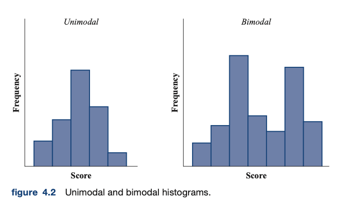
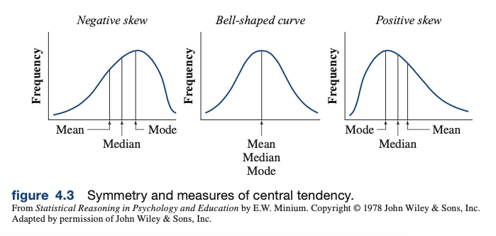

## Chapter 4: Measures of Central Tendency and Variability
### Introduction
- Frequency distributions are useful for organizing and presenting data, but by themselves, do not allow for quantitative statements that characterize distribution as a whole
- Frequency distributions also do not allow for quantitative comparisons between two or more distributions
- Distributions can have characteristics like *central tendency* and *variability*
- Variability describes the extent to which scores are different from each other, are dispersed, or are spread out
### Measures of Central Tendency
- Most common measures of central tendency are arithmetic mean, median, and mode
#### Arithmetic Mean
- This is the value ordinarily calculated when you average something
- `arithmetic mean`: defined as sum of the scores divided by the number of scores
- Two different symbols are used for the mean
  - `x̄`: "x-bar" represents the mean of sample scores
  - `μ`: "mu" represents the mean of a population set of scores
- Computations are the same, regardless of whether it is a population or sample
##### Properties of the mean
- *Mean is sensitive to the exact value of all scores in the distribution*
  - A change in any of the scores will cause a change in the mean
- *The sum of the deviations about the mean equals zero*
  - This means that Σ(Xi - x̄) = 0
  - The mean is the "balance point" of a distribution
- *The mean is very sensitive to extreme scores*
  - The mean is much more sensitive to extreme scores (outliers) than the median or the mode
- *The sum of the squared deviations of all the scores about their mean is a minimum.*
  - Σ(Xi - x̄)2
  - States that although the sum of the squared deviations about the mean does not usually equal zero, this sum is smaller than if the squared deviations were taken about any other value
  - This property is used in many areas of statistics, particularly in regression
- *Under most circumstances, of the measures used for central tendency, the mean is least subject to sampling variation*
  - The mean varies less than the median or the mode typically does for a given sample
  - This is why the mean is used in inferential statistics whenever possible
#### The Overall Mean
- Sometimes we want to calculate the mean of all the scores combined, where we already know the mean of several groups of scores
- If we have several groups of scores, the *overall mean* is equal to the sum of the mean of each group times the number of scores in that group, divided by the sum of the number of scores in each group
- Overall mean is sometimes called the *weighted mean*
#### The Median
- Second most frequently encountered measure of central tendency
- `median`: scale value below which 50% of the scores fall. It is the same as P50
- When dealing with ungrouped (raw) scores, arrange the scores in rank order
  - If number of scores is odd, the center most score is the median
  - If number of scores is even, take the average of the two center most scores
  - If the median occurs at a value where there are tied scores, use the tied score as the median
##### Properties of the median
- *The median is less sensitive than the mean to extreme scores*
  - The median is not responsive to each individual score, but rather, divides the distribution in half
  - If a distribution is strongly skewed, it can be better to represent the central tendency with the median rather than the mean
- *Under usual circumstances, the median is more subject to sampling variability than the mean, but less subject to sampling variability than the mode*
  - The median is less stable from sample to sample, so it is not as useful in inferential statistics
#### The Mode
- `mode`: the most frequent score in the distribution
  - If all the scores in a distribution have the same frequency, customary to say there is no mode
- With grouped scores, the mode is designated as the midpoint of the interval with the highest frequency
- Usually, distributions are *unimodal*, they have only one mode
- However, a distribution can have many modes, if there are two modes, the distribution is called *bimodal*
- Because the mode is not stable from sample to sample, it is not used very often
- 
#### Measures of Central Tendency and Symmetry
- If a distribution is unimodal and symmetrical, the mean, median, and mode will all be equal
- If a distribution is skewed, the mean and median will not be equal
- Since the mean is most affected by extreme scores, it will have a value closer to the extreme scores than the median
- With negative skew, mean will be lower than the median
- With positive skew, the mean will be larger than the median
- 
### Measures of Variability
- Variability specifies how far apart the scores are spread
- Measure of central tendency quantify the average value of a distribution, measure of variability quantify the extent of dispersion
- Three common measures, range, standard deviation, and variance
#### The Range
- `range`: difference between the highest and lowest scores in the distribution
  - Range = Highest score - Lowest Score
- Range is easy to calculate, but a relatively crude measure, as it measures the spread of only extreme scores and not the spread of any scores in between
#### The Standard Deviation
##### Deviation Scores
- Raw scores are the score as originally measured
- `deviation score`: how far away the raw score is from the mean of its distribution
  - Deviation score for sample data: X - "x bar"
  - Deviation score for population data: X - "mu"
- Sum of squares / sum of squared deviations
- When calculating the standard deviation of sample data, usually want to use calculation to estimate population standard deviation
##### Properties of the standard deviation
- *Standard deviation gives a measure of dispersion relative to the mean*
- *Standard deviation is sensitive to each score in the distribution*
- *Like the mean, standard deviation is stable with regard to sampling fluctuations*
  - The leads to standard deviation being used much more often than the range
  - Both the mean and the standard deviation can be manipulated algebraically
#### The Variance
- The variance of a set of scores is the square of the standard deviation
- Variance is not used much in descriptive statistics because it gives us squared units of measurement, but it is used quite frequently in inferential statistics