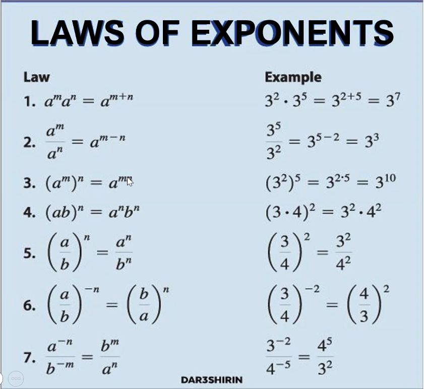
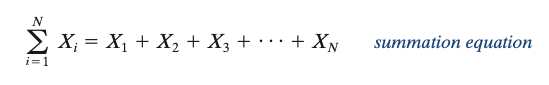
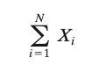

# Unit 1 Part B - Introduction to Statistical Concepts: Variables and Scales of Measurement

## Lecture Notes
### Exponents
- Any number raised to the zero power is 1
- Exponents raised to exponents
  - Ex: `(2^4)^2` becomes the same as `2^8`
- Multiplying numbers raised to exponents
  - This only works when the bases are the same
  - Combine the bases and add the exponents
  - Ex: `5^3 * 5^3` is the same as `5^6`
  - If the bases are not the same, cannot combine the numbers in this way
- Dividing numbers raised to exponents
  - If you have the same bases, you can combine the bases and subtract the exponents
  - Must subtract the denominator exponent from the numerator exponent
  - Ex: (48)/(45) is the same as 48-5, or 43 
- Numbers multiplied in Parentheses in Exponents
  - Ex: (ab)y = ayby
- 
### Parentheses
- Parentheses are used to change the "natural" order of the orders of operation
### Commutative Property of Multiplication
- Order of multiplication does not matter
  - a * b * c is the same as c * b * a
- This property does not exist for division
### Associative Property of Multiplication
- It doesn't matter where you put the parentheses for multiplying numbers together
- This is a function of the commutative property
- a * (b * c) is the same as (a * b) * c
- This property does not exist for division
### Commutative Property of Addition
- It does not matter which order we add numbers in
- This property does not exist for subtraction
### Associative Property of Addition
- It does not matter where you put parentheses when adding numbers together
- This property does not exist for subtraction
### Distributive Property
- Multiplication over addition
  - Ex: 2(3 + 4) = 2 * 3 + 2 * 4 = 2(7) = 14
- Multiplication over subtraction
  - Ex: 2(3 - 4) = 2 * 3 - 2 * 4 = 2(-1) = -2
- Can distribute the number outside the parentheses to any number that is inside the parentheses that is being added/subtracted
- "Factoring" is the process of reversing the distributive property
  - Ex: 6 + 8 - 10 + 4 = 2 * 3 + 2 * 4 - 2 * 5 + 2 * 2 = 2(3 + 4 - 5 + 2)

### Summation Sign
- See page 27 in textbook for description
- Scalar variable is a variable that can take on one value only
  - This is the type of variable that people might commonly think of
  - Ex: 2a = 10
- Vector/Matrix variables
  - Summation sign can be used with both vectors and matrices
- Summation sign is noted by the capital greek letter sigma
  - `∑`
- Summation sign for vectors
  - The top number (over ∑) is where to "stop" in the vector
  - The bottom statement (*i = ...*) is where to "start" in the vector
  - 
  - 
- Largest index in a vector is referred to as N
  - So if our vector is [2, 3, 4, 5] then N = 5
- When adding all numbers, often the convention is to leave off the "counter" and just write ∑xi 
- Summation sign and order of operations
  - Parentheses
  - Exponents
  - Multiplication / Division
  - **Summation Sign**
  - Addition / Subtraction
- NOTE THAT THE SUMMATION SIGN IS A UNIT
  - So this means that for `∑x * 2`, you take the sum of x, then multiply by two, because `∑x` is a unit
    - However, the distributive property means that `∑x * 2` is the same as `∑(x * 2)`

# Unit 1 Part B Scales of Measurement Quiz
#### Question 1
- Text: The Interval Scale of Measurement consists of:
- Answer: (c) Ordered, Equal Size Intervals with an Arbitrary Zero Point
#### Question 2
- Text: The Ratio Scale of Measurement consists of:
- Answer: (d) Ordered, Equal Size Intervals with a True Zero Point
#### Question 3
- Text: The Nominal Scale of Measurement consists of:
- Answer: (a) Discrete Unordered Categories
#### Question 4
- Text: The Ordinal Scale of Measurement consists of:
- Answer:  (b) Discrete Ordered Categories
#### Question 5
- Text: Which of the following Scales of Measurement always consist of Qualitative Data?
- Answer:  (f) Both (c) and (d) are correct
  - (c) Ordinal Scale
  - (d) Nominal Scale
#### Question 6
- Text: Which of the following Scales of Measurement always consist of Quantitative Data?
- Answer: (e) Both (a) and (b) are correct
  - (a) Ratio Scale
  - (b) Interval Scale
#### Question 7
- Text: Which of the following Scales of Measurement ALWAYS consist of Discrete Data?
- Answer: (f) Both (c) and (d) are correct
#### Question 8
- Text: Which of the following Scales of Measurement ALWAYS consist of Continuous Data?
- Answer: (h) None of (a), (b), (c), or (d) are correct
#### Question 9
- Text: Which of the following Scales of Measurement CAN consist of Continuous Data OR Discrete Data?
- Answer: (e) Both (a) and (b) are correct
#### Question 10
- Text: Which of the following is true of Discrete Data? 
- Answer: (c) May consist of Two or More Categories as long as the Number of Categories is Finite
#### Question 11
- Text: Which of the following is true of Continuous Data?
- Answer: (d) Potentially consists of an Infinite Number of Categories
#### Question 12
- Text: For which of the following Scales of Measurement are there three possible Mathematical Operations that can be performed: (1) "Equal to" and "Not Equal to", (2) "Greater than" and "Less than", and (3) Addition and Subtraction?
- Answer: (b) Interval Scale
#### Question 13
- Text: For which of the following Scales of Measurement is the only possible Mathematical Operation "Equal to" and "Not Equal to"?
- Answer: (d) Nominal Scale
#### Question 14
- Text: For which of the following Scales of Measurement are there four possible Mathematical Operations that can be performed: (1) "Equal to" and "Not Equal to", (2) "Greater than" and "Less than", (3) Addition and Subtraction, and (4) Multiplication and Division?
- Answer: (a) Ratio Scale
#### Question 15
- Text: For which of the following Scales of Measurement are there two possible Mathematical Operations that can be performed: (1) "Equal to" and "Not Equal to" and (2) "Greater than" and "Less than"?
- Answer: (c) Ordinal Scale
#### Question 16
- Text: Is the following statement meaningful or does it actually not make any sense? 100 degrees Fahrenheit is twice as hot as 50 degrees Fahrenheit.
- Answer: The statement is NOT meaningful and does NOT make sense
#### Question 17
- Text: Is the following statement meaningful or does it actually not make any sense? 100 pounds is twice as heavy as 50 pounds.
- Answer: The statement is meaningful and does make sense
#### Question 18
- Text: Is the following statement meaningful or does it actually not make any sense? A score of 100 on an Exam is Four Times a score of 25 on the Same Exam.
- Answer: The statement is meaningful and does make sense
#### Question 19
- Text: Is the following statement meaningful or does it actually not make any sense? A classroom with 30 students has Three Times as many students as a classroom with 10 students.
- Answer: The statement is meaningful and does make sense
#### Question 20
- Text: Is the following statement meaningful or does it actually not make any sense? A Size 30 Dress is Five Times as Large as a Size 6 Dress.
- Answer: The statement is NOT meaningful and does NOT make sense
#### Question 21
- Text: The Number of Apples a person ate is measured on which of the following Scales of Measurement?
- Answer:  (a) Ratio Scale
#### Question 22
- Text: If you had individuals select their single favorite Musical Genres (e.g. Classic Rock, Country, Hip-Hop, Pop, Classical, Jazz, Other), the data would be measured on which of the following Scales of Measurement
- Answer:  (d) Nominal Scale
#### Question 23
- Text: Fill in the blanks with the correct numbers (in the correct order): In terms of Mathematics, there are _________ Scales of Measurement. In terms of Statistics, there are ___________ Scales of Measurement.
- Answer: Not (d), (g), (e)
  - Likely (f)
#### Question 24
- Text: Which of the following is (are) true for the variable Number of Children in a Family?
- Answer:  (h) Both (a) and (f)
#### Question 25
- Text: Which of the following is (are) true for the variable Temperature measured in Fahrenheit?
- Answer: (g) Both (b) and (e)
#### Question 26
- Text: Which of the following is (are) true for the variable Letter Grades? 
- Answer:  (g) Both (c) and (e)
#### Question 27
- Text: Which of the following is (are) true of the variable Numeric Grade on a test ranging from 0 to 100? 
- Answer:  (g) Both (a) and (e)
#### Question 28
- Text: Which of the following is (are) true of the variable College Major?
- Answer: (h) Both (d) and (f)

